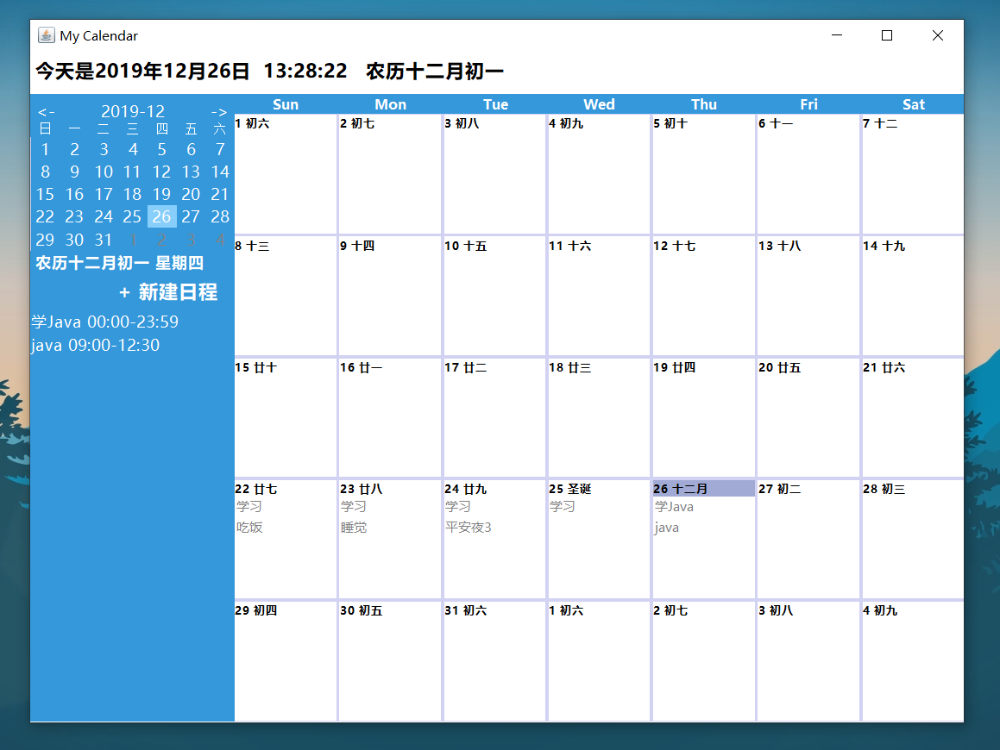
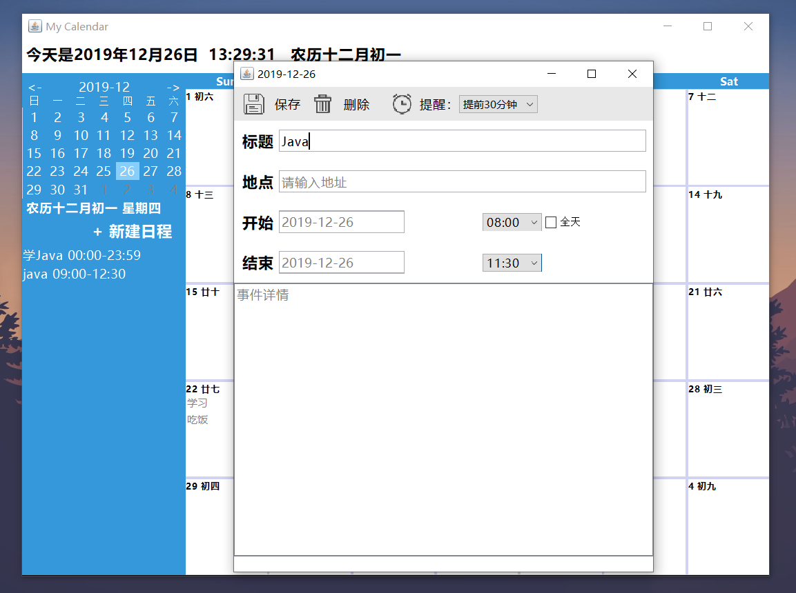
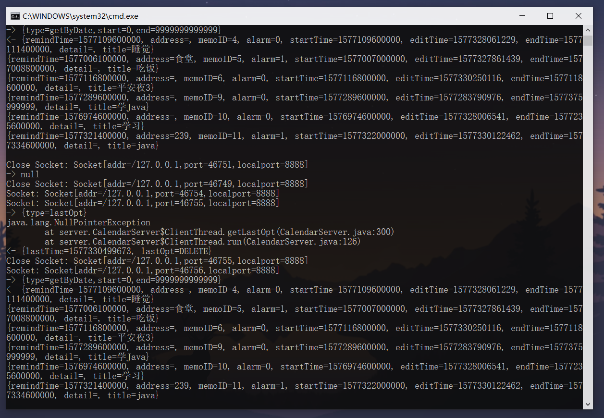

# Java-Calendar
This is a desktop Calendar application written by Java. 

这是用Java Swing写的一个日历应用，可以添加日程提醒，支持本地、服务器双向同步。

#### 使用方法

> :warning:由于服务端采用sqlite存储，须提前在`./sqlite`目录下新建`todolist.db`数据库文件。
>
> 1. 双击`runServer.cmd`启动服务器
> 2. 双击`runClient.cmd`启动客户端主程序（服务器未连接也可本地运行）

- 主界面

- 添加日程

- 数据库服务器

